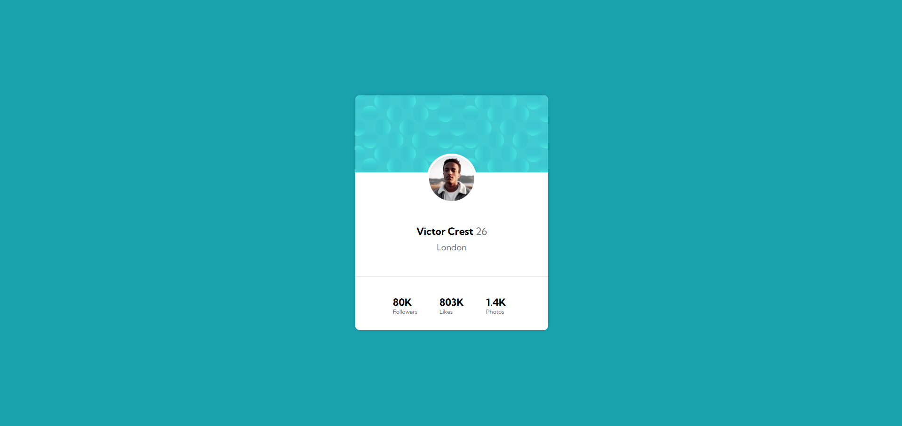

# Frontend Mentor - Profile card component solution

Esta é uma solução para o desafio do componente Cartão de perfil no Frontend Mentor. Os desafios do Frontend Mentor ajudam a melhorar as suas competências de programação através da criação de projetos realistas.

### Screenshot

### Links

- Repositório: [GitHub](https://github.com/bruninhosrs/profile-card-component-main)
- Live Site URL: [Add live site URL here]()

## My process

### Built with

- Semantic HTML5 markup
- CSS custom properties
- Flexbox
- Mobile-first workflow

## Autor

- GitHub - [Bruno Rodrigues](https://github.com/bruninhosrs)
- Mentor de Frontend - [@bruninhosrs](https://www.frontendmentor.io/profile/bruninhosrs)
- LinkedIn - [Bruno Rodrigues](www.linkedin.com/in/rodrigues-silva-bruno)
